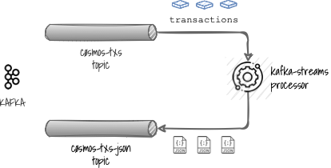

# Kafka Processor Decode Cosmos TX

[](https://github.com/okp4/kafka-processor-cosmos-tx-proto2json/releases)
[](https://github.com/okp4/kafka-processor-cosmos-tx-proto2json/actions/workflows/build.yml)
[](https://github.com/okp4/kafka-processor-cosmos-tx-proto2json/actions/workflows/lint.yml)
[](https://github.com/okp4/kafka-processor-cosmos-tx-proto2json/actions/workflows/test.yml)
[](https://conventionalcommits.org)
[](https://opensource.org/licenses/BSD-3-Clause)
[](https://quarkus.io)

## Purpose

A Kafka Streams Processor that consumes [CØSMOS](https://github.com/cosmos/cosmos-sdk) and [ØKP4](https://github.com/okp4/okp4d)
[Protobuf](https://developers.google.com/protocol-buffers) messages from an `input` Kafka topic and sends a [JSON](https://www.json.org/json-en.html)
decoded message in the `output` topic.

<p align="center">
  
</p>

## Implementation

Implementation mainly relies on [Kafka Streams API](https://kafka.apache.org/documentation/streams), library to create
event-stream applications with the following features:

- no external dependency other than Kafka itself,
- simple and light library,
- fault-tolerant and scalable.

Moreover, this implementation:

- uses [Kotkin](https://kotlinlang.org/) as primary coding language,
- uses [Quarkus](https://quarkus.io/) to minimize resources consumption,
- is as much as possible, lean, i.e. tries to minimize the dependencies to 3rd party libraries and the resulting package
  footprint.

## Build

This project targets the [JVM 11+](https://openjdk.java.net/), so be sure to have it available in your environment.

This project relies on the [Gradle](https://gradle.org/) build system.

If you are on Windows then open a command line, go into the root directory and run:

```sh
.\gradlew build
```

If you are on linux/mac then open a terminal, go into the root directory and run:

```sh
./gradlew build
```

This command line produces a _native_ executable: `kafka-processor-cosmos-tx-proto2json-X.Y-runner`
